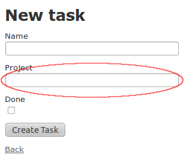

!SLIDE subsection

# Rails App #

!SLIDE commandline

# Install rails #

    $ gem install rails

    $ gem install sqlite3
    
    $ <ubuntu> sudo apt-get install sqlite3

!SLIDE commandline

# Create a rails app #

    $ rails new to_do

      create  README
      create  Rakefile
      ...
      create  vendor/plugins/
      create  vendor/plugins/.gitkeep

!SLIDE commandline

# Launch the site

    $ cd to_do
    
    $ rails s

!SLIDE code

    .
    ├── app
    │   ├── models
    │   ├── views
    │   ├── controllers
    │   └── ...
    ├── config
    ├── db
    │   └── migrate
    ├── public
    │   ├── images
    │   ├── javascripts
    │   └── stylesheets
    └── ...

!SLIDE commandline

# Project Scaffolding

    $ rails g scaffold Project name:string

      create    db/migrate/20110627160358_create_projects.rb
      create    app/models/project.rb
      ...
      route  resources :projects
      ...
      create    app/controllers/projects_controller.rb
      ...
      create      app/views/projects
      create      app/views/projects/index.html.erb
      create      app/views/projects/edit.html.erb
      create      app/views/projects/show.html.erb
      create      app/views/projects/new.html.erb
      create      app/views/projects/_form.html.erb
      ...
      create    public/stylesheets/scaffold.css
      ...

!SLIDE commandline

# Run migrations! #

    $ rake db:migrate

      ==  CreateProjects: migrating =================================================
      -- create_table(:projects)
         -> 0.0026s
      ==  CreateProjects: migrated (0.0027s) ========================================

    Creates a table with 4 fields: id, name, created_at & updated_at

!SLIDE bullets

# Interact with your projects #

* `rails s`
* http://localhost:8080/projects
* Create 3 projects.

!SLIDE commandline

# Interact with your projects(II) #

    $ rails c
    Loading development environment (Rails 3.0.7)
    $ ruby-1.9.2-p0 > p1 = Project.new
     => #<Project id: nil, name: nil, created_at: nil, updated_at: nil> 
    $ ruby-1.9.2-p0 > p1.name = "New project"
     => "hello"
    $ ruby-1.9.2-p0 > p1.save
     => true
    $ ruby-1.9.2-p0 > p2 = Project.new(:name => "Initialized project")
     => #<Project id: nil, name: "Thank you", created_at: nil, updated_at: nil>
    $ ruby-1.9.2-p0 > p2.save
     => true
    $ ruby-1.9.2-p0 > p3 = Project.create(:name => "Saved project")
     => #<Project id: 2, name: "Saved project", created_at: "2011-06-28 12:55:40", updated_at: "2011-06-28 12:55:40"> 

!SLIDE

# Generated files #

!SLIDE code

    @@@ ruby
    # db/migrate/...create_projects.rb
    class CreateProjects < ActiveRecord::Migration
      def self.up
        create_table :projects do |t|
          t.string :name

          t.timestamps
        end
      end

      def self.down
        drop_table :projects
      end
    end

!SLIDE code

    @@@ ruby
    # app/controllers/projects_controller.rb
    class ProjectsController < ApplicationController

      # index, show, new, create
      # edit, update, & destroy

    end

!SLIDE code

## app/views/projects/ ##

    .
    ├── edit.html.erb
    ├── _form.html.erb
    ├── index.html.erb
    ├── new.html.erb
    └── show.html.erb

!SLIDE code

    @@@ ruby
    # config/routes.rb
    Todo::Application.routes.draw do
      resources :projects
    ...
    end

    # app/models/project.rb
    class Project < ActiveRecord::Base
    end

!SLIDE

## The root url ##

!SLIDE commandline

    $rm public/index.html

!SLIDE

    @@@ ruby
    # config/routes.rb
    
    ...
    # root :to => "welcome#index"
    ...
    
    root :to => "projects#index"
    

!SLIDE

## Validations ##

!SLIDE code

    @@@ ruby
    class Project < ActiveRecord::Base
      # add these two lines
      validates_presence_of :name
      validates_uniqueness_of :name
    end

!SLIDE bullets

# Try to create a project #

* Without name
* or
* With an already taken name

!SLIDE commandline

# Task scaffolding

    $ rails g scaffold Task name:string project_id:integer done:boolean
    ...
    $ rake db:migrate

!SLIDE

# `has_many` & `belongs_to` #

!SLIDE code

    @@@ ruby
    # app/models/project.rb
    class Project < ActiveRecord::Base
      ...
      # add this line:
      has_many :tasks
    end

    # app/models/task.rb
    class Task < ActiveRecord::Base
      # add this line:
      belongs_to :project
    end

!SLIDE commandline

# `has_many` #

    $ rails c
    Loading development environment (Rails 3.0.7)
    $ ruby-1.9.2-p0 > p = Project.first
     => #<Project id: 1, name: 'foo', created_at: nil, updated_at: nil>
     
    $ ruby-1.9.2-p0 > p.tasks
     => []
     
    $ ruby-1.9.2-p0 > p.tasks.create(:name => "Clean dishes")
     => #<Task id: 1, name: "Clean dishes", project_id: 1, done: false, ...
     
    $ ruby-1.9.2-p0 > p.tasks.create(:name => "Take dog out")
     => #<Task id: 2, name: "Take dog out", project_id: 1, done: false, ...
    
    $ ruby-1.9.2-p0 > p.tasks.count
     => 2

!SLIDE commandline

# `belongs_to` #

    $ ruby-1.9.2-p0 > t = Tasks.find(2)
     => #<Task id: 2, name: "Take dog out", project_id: 1, done: false, ...
     
    $ ruby-1.9.2-p0 > t.project_id
     => 1
     
    $ ruby-1.9.2-p0 > t.project
     => #<Project id: 1, name: 'foo', created_at: nil, updated_at: nil>
    
    $ ruby-1.9.2-p0 > t.project_id = 2
     => 2
    
    $ ruby-1.9.2-p0 > t.save
     => true
    
    $ ruby-1.9.2-p0 > t.project
     => #<Project id: 2, name: 'bar', created_at: nil, updated_at: nil>

!SLIDE

# Adding a drop-down #

!SLIDE center

!SLIDE code

    @@@ ruby
    # app/controllers/tasks_controller.rb

    class TasksController < ApplicationController
      before_filter :calculate_projects
      
      ...

      private

      def calculate_projects
        @projects = Project.all
      end
    end

!SLIDE code

    @@@ ruby
    # app/controllers/tasks_controller.rb

    class TasksController < ApplicationController
      before_filter :calculate_projects,
        :only => [:new, :create, :edit, :update]
      
      ...

      private

      def calculate_projects
        @projects = Project.all
      end
    end

!SLIDE code

## app/views/tasks/_form.rb ##

    @@@ ruby

    <%= f.text_field :project_id %>

    # change that to this VVVVVV

    <%= f.collection_select :project_id, @projects,
        :id, :name, :include_blank => true
    %>

!SLIDE

# Showing the tasks #

!SLIDE code

    # app/models/task.rb
    
    class Task < ActiveRecord::Base
    
    ...

      def status
        if self.done
          return "done"
        else
          return "not done"
        end
      end
    
    end

!SLIDE code

    # app/models/task.rb
    
    class Task < ActiveRecord::Base
    
    ...

      def status
        return self.done ? "done" : "not done"
      end
    
    end

!SLIDE code

    # app/models/task.rb
    
    class Task < ActiveRecord::Base
    
    ...

      def status
        return done ? "done" : "not done"
      end
    
    end

!SLIDE code

    # app/models/task.rb
    
    class Task < ActiveRecord::Base
    
    ...

      def status
        done ? "done" : "not done"
      end
    
    end

!SLIDE code

    # app/views/projects/show.html.erb
    
    

      <b>Name:</b>
      <%= @project.name %>
    

    <!-- add this: -->
    <ul>
      <% @project.tasks.each do |task| %>
        <li><%= task.name %>: <%= task.status %></li>
      <% end %>
    </ul>
    
    ...

